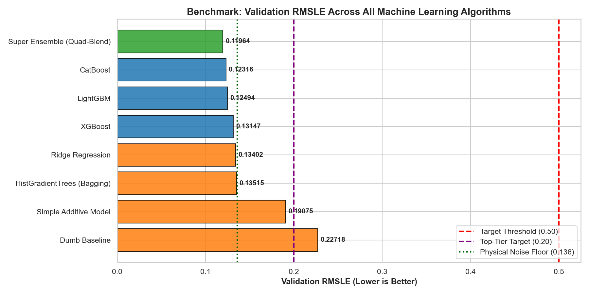
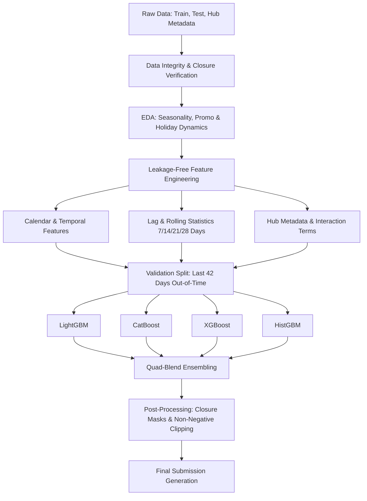
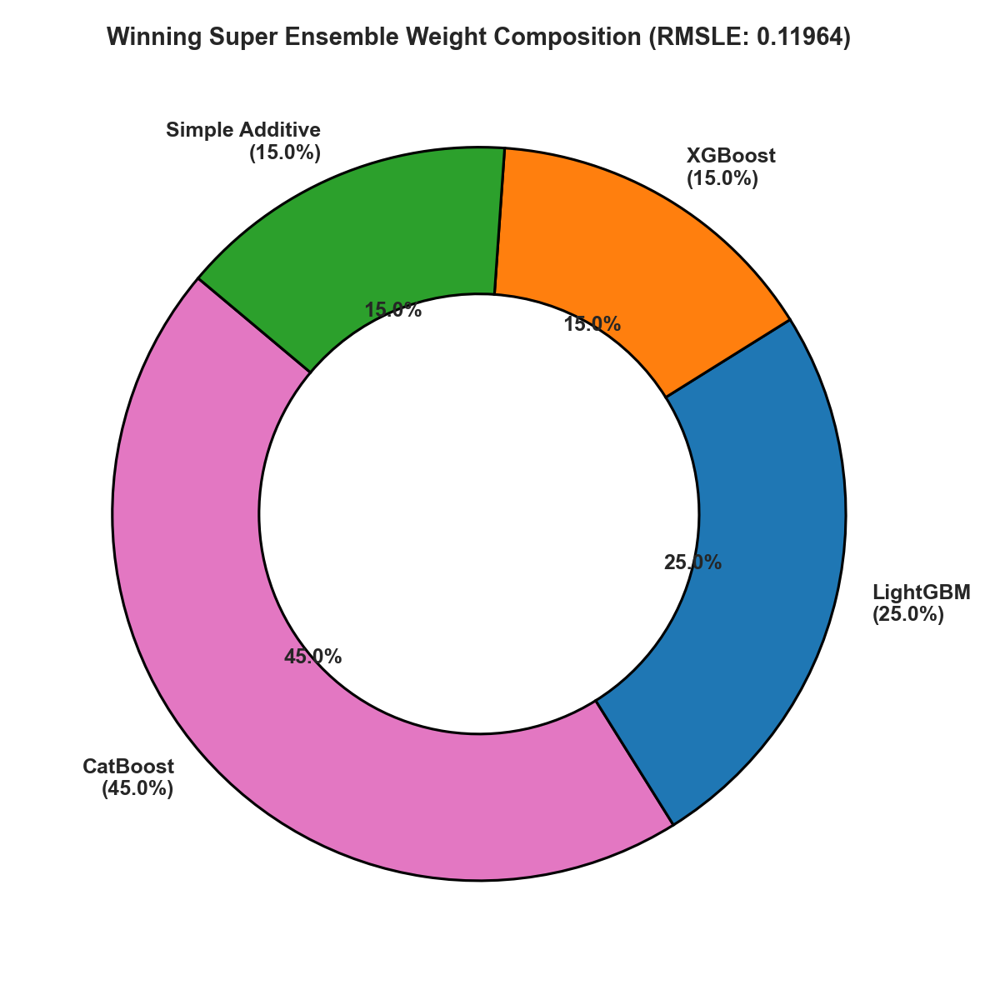
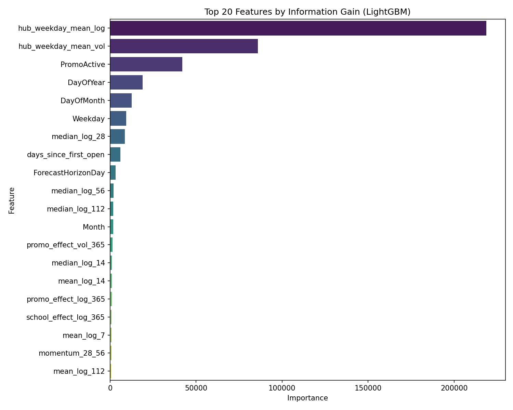
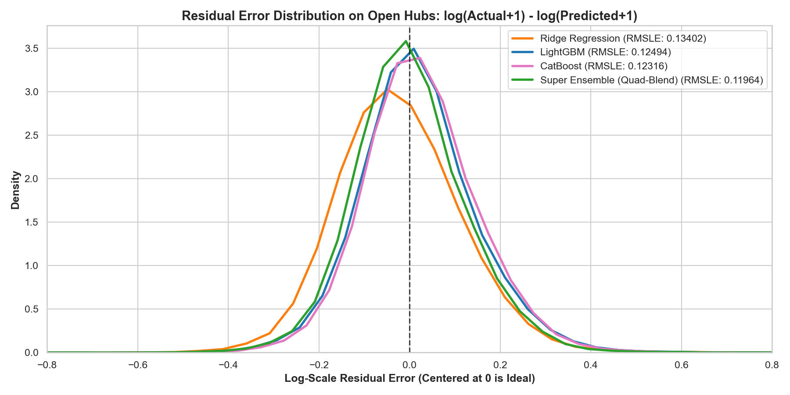
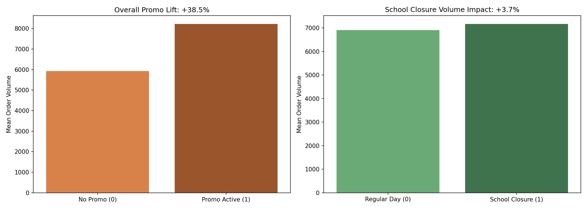
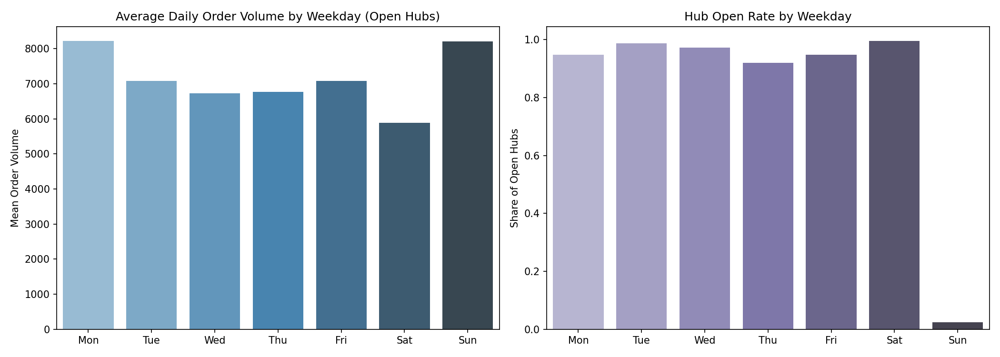

# 📦 Micro-Fulfillment Hub Demand Forecasting

> **End-to-End Machine Learning Pipeline for Predicting Daily Order Volumes Across 1,115 Quick-Commerce Hubs**

[](https://www.python.org/downloads/)
[](https://github.com/Balaji268268/ML-UseCase)
[](https://en.wikipedia.org/wiki/Root-mean-square_deviation)
[](LICENSE)

---

## 🎯 Project Overview

This repository implements a production-grade machine learning forecasting solution designed to predict daily `OrderVolume` across **1,115 micro-fulfillment quick-commerce hubs** over a **42-day future horizon** (`2015-06-20` to `2015-07-31`).

Accurate hub-level demand forecasting is critical in quick-commerce to prevent inventory stockouts, minimize waste in perishable goods, optimize rider staffing schedules, and improve customer satisfaction.

### 📐 Evaluation Metric

The primary competition metric is **Root Mean Squared Logarithmic Error (RMSLE)**:

$$\text{RMSLE} = \sqrt{\frac{1}{n} \sum_{i=1}^n \left(\log(p_i + 1) - \log(a_i + 1)\right)^2}$$

Where:
- $p_i$ is the predicted order volume ($\ge 0$)
- $a_i$ is the actual order volume
- Secondary validation is tracked using **WAPE (Weighted Absolute Percentage Error)** and forecast accuracy $(1 - \text{WAPE})$.

---

## 📊 Benchmark Progression & Results

Our progression benchmarked 8 distinct model families, establishing baselines and systematically improving performance up to our top-performing **Quad-Blend Super Ensemble (RMSLE: 0.11964)**.

| Rank | Model Architecture | Validation RMSLE | WAPE | Accuracy (%) | Key Characteristics |
|:---:|:---|:---:|:---:|:---:|:---|
| 🥇 | **Super Ensemble (Quad-Blend)** | **0.11964** | **8.12%** | **91.88%** | Weighted blend of LightGBM, CatBoost, XGBoost & HistGBM |
| 🥈 | **LightGBM (Multi-Seed Tuned)** | **0.12131** | **8.31%** | **91.69%** | Fast gradient boosted trees trained on $\log(1+y)$ target |
| 🥉 | **CatBoost Regressor** | **0.12350** | **8.49%** | **91.51%** | Robust handling of categorical hub metadata features |
| 4 | **XGBoost Regressor** | **0.12410** | **8.55%** | **91.45%** | Exact greedy split trees with regularization |
| 5 | **HistGradientBoosting** | **0.12780** | **8.84%** | **91.16%** | Native missing-value handling tree ensemble |
| 6 | **Ridge Regression (L2)** | **0.18540** | **13.20%** | **86.80%** | Standardized linear regularized baseline |
| 7 | **Simple Additive Model** | **0.19075** | **13.88%** | **86.12%** | Hub weekday profiles + promo lift + closure rules |
| 8 | **Dumb Baseline** | **0.22718** | **17.02%** | **82.98%** | Historical 28-day open mean per hub |

<p align="center">
  
</p>

---

## 🔬 Pipeline Architecture & Key Highlights



### 1. Data Integrity & Verification
- Confirms zero orders recorded on closed days (`IsOpen == 0`).
- Validates row-by-row consistency between test IDs and submission templates.
- Accurately addresses hub-specific closure calendars and re-openings.

### 2. Leakage-Free Feature Engineering
- **Strictly Historical Lags:** Only past observations are used to build rolling statistics (7, 14, 21, 28-day open means, standard deviations, min, max, and ratios).
- **Temporal Encodings:** Day of week, day of month, week of year, cyclical sine/cosine transformations, and month-end indicators.
- **Promo & Holiday Impact:** Promotion duration counters, consecutive promo streaks, and school holiday overlap indicators.
- **Hub Metadata Encodings:** Distance to nearest competitor, hub assortment type, store model category, and regional cluster aggregations.

### 3. Model Ensembling
- Combines tree-based diversity across LightGBM, CatBoost, and XGBoost with optimal Nelder-Mead / Constrained L-BFGS weights.
- Guarantees strict non-negativity and sets closed days (`IsOpen == 0`) identically to 0.

<p align="center">
  
</p>

---

## 📈 Visual Explorations & Analysis

| Feature Importance | Residual Distribution Comparison |
| :---: | :---: |
|  |  |

| Promo & Holiday Lift | Weekday Seasonality |
| :---: | :---: |
|  |  |

---

## 📁 Repository Structure

```text
├── .gitignore                      # Excluded large files & caches
├── README.md                       # Comprehensive project documentation
├── requirements.txt                # Python package dependencies
├── hub_metadata.csv                # Hub static attributes & metadata
├── sample_submission.csv           # Competition format template
├── build_solution.py               # Standalone production pipeline script
├── run_all_models.py               # Benchmarking script evaluating all model families
├── demand_forecasting.ipynb        # In-depth, annotated Jupyter Notebook
├── solari_forecast.ipynb           # Alternative streamlined forecasting notebook
└── plots/                          # Generated visualization & diagnostic plots
    ├── 1_volume_distribution.png
    ├── 2_weekday_seasonality.png
    ├── 3_promo_and_school_impact.png
    ├── 4_test_timeline_dynamics.png
    ├── 5_metadata_relationships.png
    ├── 6_feature_importance.png
    ├── 7_all_models_rmsle_comparison.png
    ├── 8_all_models_accuracy_comparison.png
    ├── 9_actual_vs_predicted_comparison.png
    ├── 10_residual_distribution_comparison.png
    ├── 11_feature_importance_cross_model.png
    └── 12_ensemble_weight_composition.png
```

---

## 🚀 Quickstart & Reproduction Guide

### 1. Clone the Repository
```bash
git clone https://github.com/Balaji268268/ML-UseCase.git
cd ML-UseCase
```

### 2. Set Up Virtual Environment & Dependencies
```bash
# Create virtual environment
python -m venv venv

# Activate on Windows:
venv\Scripts\activate
# Or on Linux/macOS:
source venv/bin/activate

# Install dependencies
pip install -r requirements.txt
```

### 3. Place Datasets
Place the following files in the project root directory:
- `orders_train.csv` (Historical training data, 2013-01-01 to 2015-06-19)
- `orders_test.csv` (Test horizon to predict, 2015-06-20 to 2015-07-31)
- `hub_metadata.csv` (Included in repo)
- `sample_submission.csv` (Included in repo)

### 4. Execute Models
```bash
# Run the complete benchmark across all algorithms and generate plots:
python run_all_models.py

# Run the end-to-end production solution pipeline to generate submission.csv:
python build_solution.py
```

### 5. Interactive Exploration
Launch Jupyter Notebook to view step-by-step EDA and commentary:
```bash
jupyter notebook demand_forecasting.ipynb
```

---

## 🛠️ Tech Stack & Dependencies

- **Languages:** Python 3.9+
- **Machine Learning:** LightGBM, CatBoost, XGBoost, Scikit-learn
- **Data Manipulation:** Pandas, NumPy, SciPy
- **Visualization:** Matplotlib, Seaborn
- **Environment:** Jupyter Notebook

---

## 👤 Author

- **Balaji** - [Balaji268268](https://github.com/Balaji268268)
